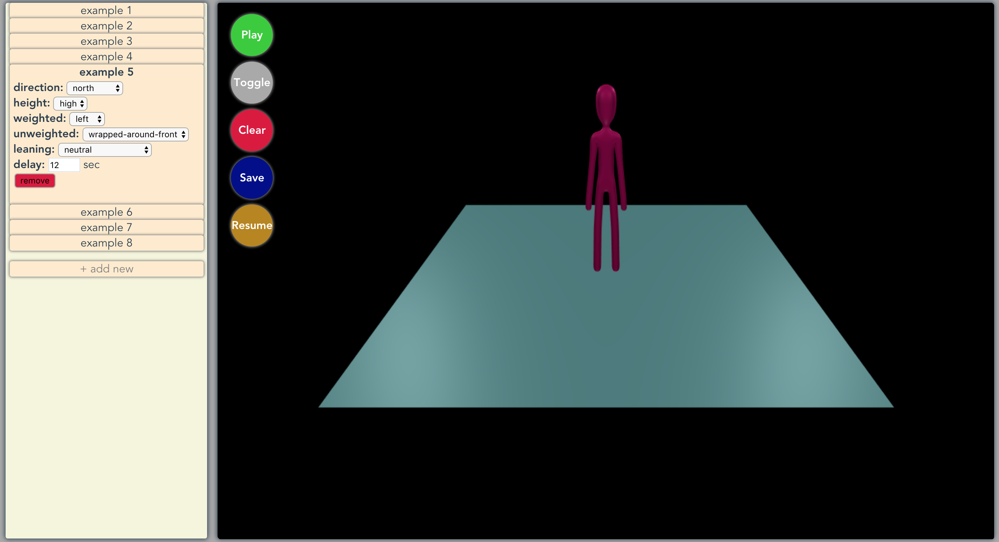
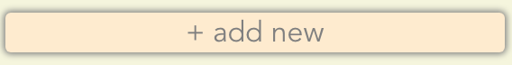
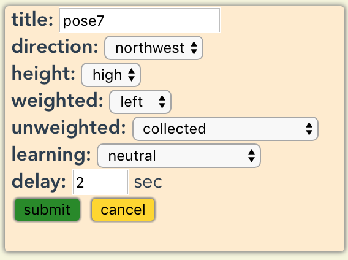
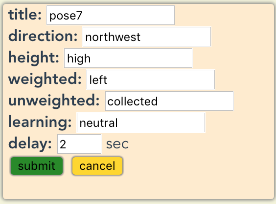
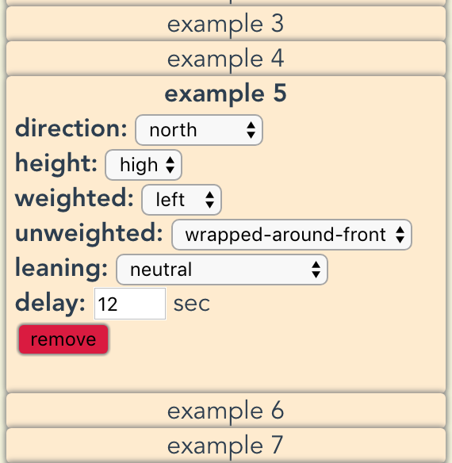
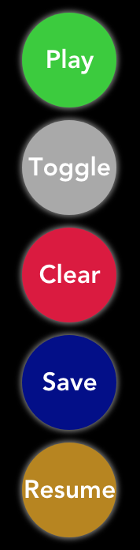
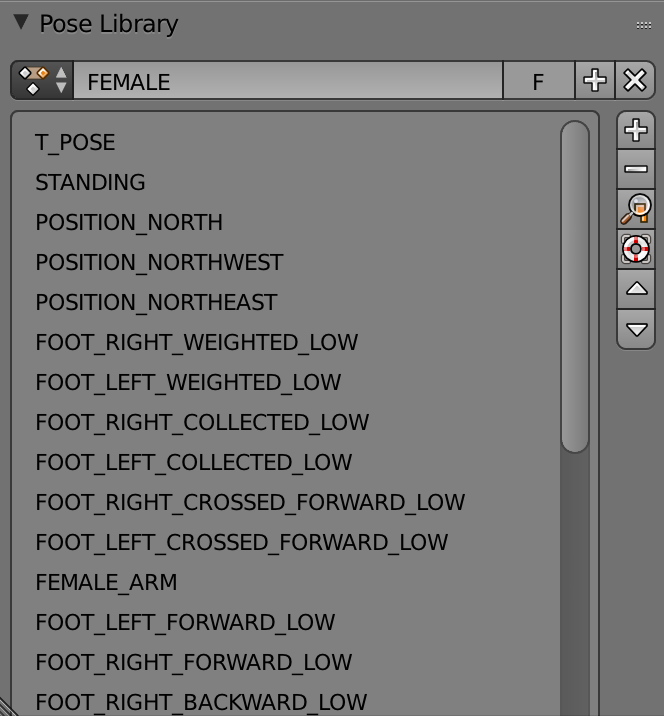
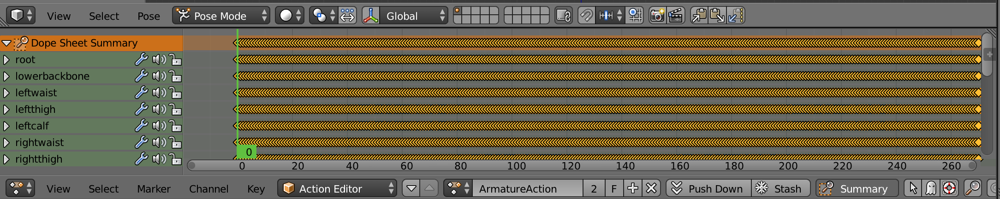
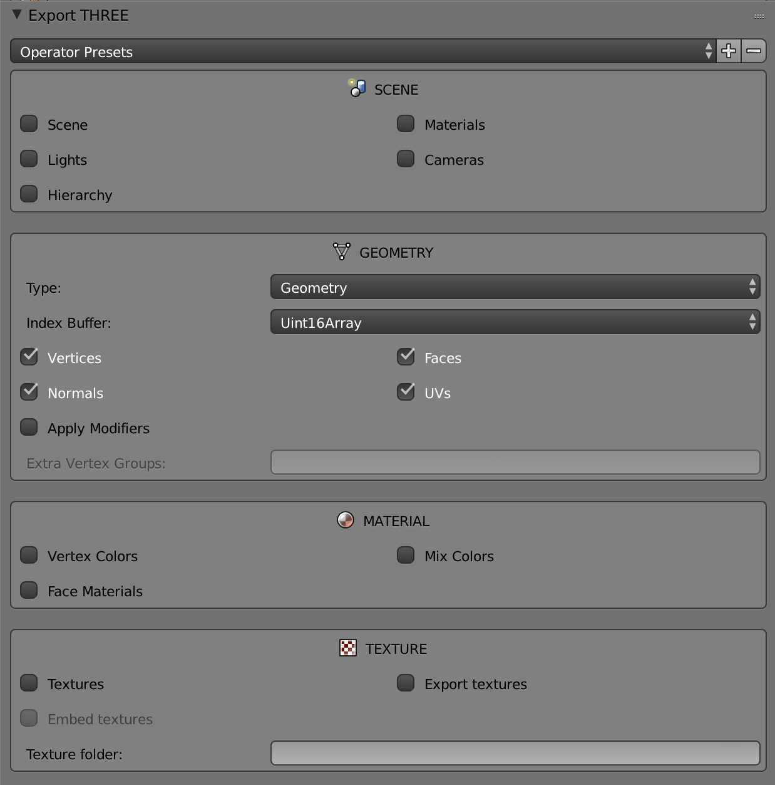

VisualTango
===========

## Table of Contents

1. [Abstract](#abstract)
2. [Build](#build)
3. [Use](#use)
4. [Tools](#tools)
5. [Blender Model](#blender-model)
6. [Credits To](#credits-to)
7. [Demo](#demo)

## Abstract

This is a web app that I created for Professor Dennis Shasha for my Independent Study at New York University.

The original purpose was to create a light-weighted web app that uses two 3D stick-figures to simulate Tango moves that the user defines.

However, due to the exploratory nature of this project and time restriction, this web app can now only simulate some follower dancer's moves and in still poses instead of animations.

In brief, one can create a sequence of poses and get an idea of what this sequence of dance moves will look like.

WARNING: These poses have not been validated by a Tango professonal. Only use it to help you build a sequence of dancing moves in your mind.

>[Go Top](#table-of-contents)

## Build

``` bash
# install dependencies
npm install

# serve with hot reload at localhost:8080
npm run dev

# build for production with minification
npm run build

# build for production and view the bundle analyzer report
npm run build --report
```

>[Go Top](#table-of-contents)

## Use

This web app contains three parts. A left-side panel used to define a sequence of Tango positions. A right-side screen used to show the 3D stick-figure. And 5 floating functional buttons.



## Left Side Panel

  You can add a new card by click on the add new button.

  

  Then the button will turn into an input panel allows you to input the details of this new card. Dropdown lists are the default way of doing this. Yet, you can choose to type in by enable the typing mode (click on the `Toggle` floating button).

  `delay` means the seconds the screen will stay at this frame when you are playing this sequence of cards.

  

  

  If you choose to type in, the words need to be precise, only letters and spaces. Below is a list of accepted terms:
  ```
  Directions: ["north", "northwest", "northeast"]
  height: ["high", "low"]
  weighted: ["left", "right"]
  unweighted: ["collected", "crossed forward", "forward", "backward", "in air forward", "in air backward", "slide out side", "wrapped around front"]
  leaning: ["neutral", "forward", "backward", "toward weighted", "toward unweighted"]
  ```

  Once a new card is created, it will be automatically expended. You can click on other cards to expend them. There can be only one expended card at a time since the app will render the expended card on the right side screen.

  

  You can arrange their order by drag and drop. You can also delete cards by expend one and click the delete button.

## Right side screen

  The screen will render a stick-figure. Simply use mouse to navigate and zoom.

## Floating buttons

  The floating buttons are some extra functions provided for ease of use.
  - `Play` click to play the sequence of cards. You won't be able to add new card while playing. After playing the figure will go back to the card that was previously expended.
  - `Toggle` the button to toggle the typing mode.
  - `Clear` clear all the cards in the list by only one click.
  - `Save` download the sequence of cards in a JSON file.
  - `Resume` upload your JSON file to resume your sequence.

  

  If you have your browser cookie enabled, the web app will frequently store your changes to the sequence to your cookie, so you won't lose anything by click on refresh by accident. For long term purpose, the `D` and `U` buttons should serve it.

>[Go Top](#table-of-contents)

## Tools

I used Blender to create my model and blender-to-three-plugin to export my model into a JSON file that can be read by THREE.js.

- [Blender](https://www.blender.org/)
- [blender-to-three-plugin](https://github.com/mrdoob/three.js/tree/master/utils/exporters/blender)

>[Go Top](#table-of-contents)

## Blender Model

The Blender model I created is `blender_models/stickman.blend`. I have also defined some bones and some bone restructions to make it available for posing. Yet, I couldn't find a way to access the poses in my Blender model's pose library from THREE.js. So I used a work around as stated below.

The Blender model contains a pose library. Each pose in this library defines the transition of part of the body. By applying multiple poses to the model, the stick-figure will be in a certain dancing position.



By using the poses in the pose library, I am able to create a long animation, in which, each frame is a different Tango position I need. In such way, I can load the animation into THREE.js in my web app and just specify which frame to play. There are totally 480 frames.



In order to create 480 frames, I wrote a script `blender_models/generate_animation_frames.py`. This script can be run inside Blender. It will generate all the combinations and insert them into the keyframes. After that, I have to go over all of them one by one to do some adjustments to make sure situations like the stick-figure's legs don't get into the floor won't happen.

Also, I have experienced difficulties using the blender-to-three exporter plugin. The Blender version I am using is `2.79b` and the plugin version is `1.5.0`. Things will be different in other versions. Below is the working configuration for me.



>[Go Top](#table-of-contents)

## Credits to

Below is a series of Blender tutorial videos that introduced me to the basic skills of using Blender.

- [A series of Blender tutorial video.](http://blender.freemovies.co.uk/stickman/)

>[Go Top](#table-of-contents)

## Demo

[](https://www.youtube.com/watch?v=xO7WGC0fHp0)

>[Go Top](#table-of-contents)
